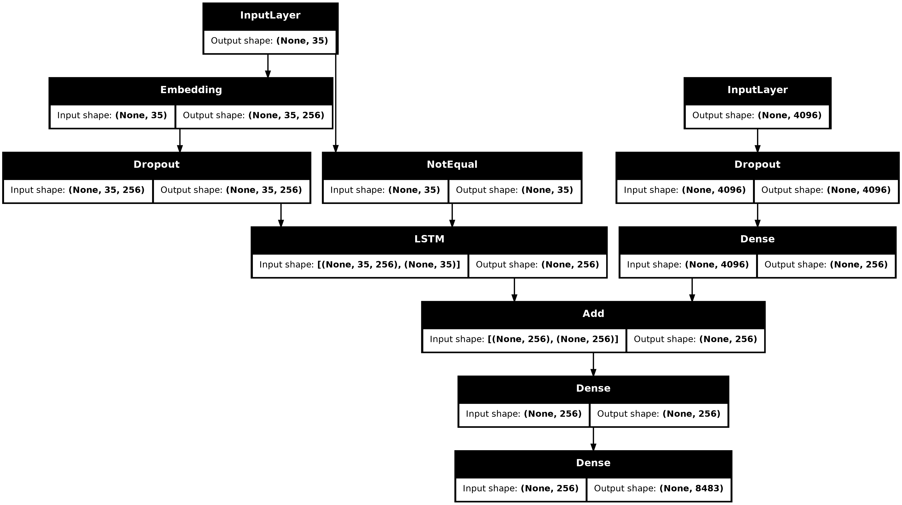

# Image-Caption-Generator

## Overview

This project is an end-to-end Deep Learning based Image Caption Generator that automatically generates natural language descriptions for images.

The system combines Computer Vision and Natural Language Processing by using a pre-trained CNN model(VGG16) for image feature extraction and an LSTM-based sequence model for caption generation. Given an input image, the model learns to understand visual content and generate meaningful captions word by word.

---

## Dataset
**Flickr8k Dataset**

- ~8,000 images
- 5 human-written captions per image
- Widely used benchmark dataset for image captioning tasks

## Project Workflow
### 1. Image Feature Extraction

A pre-trained **VGG16** model is used as a feature extractor.

- Final classification layer removed
- 4096-dimensional image embeddings generated
- Features stored for faster training

### 2. Text Processing

Caption preprocessing includes:

- Lowercasing text
- Removing special characters and numbers
- Adding `startseq` and `endseq` tokens
- Tokenization and vocabulary creation
- Sequence padding

### 3. Model Architecture

The model follows an **Encoder–Decoder architecture**.

#### Encoder
- VGG16 image features (4096 dimensions)
- Dense layer for feature projection

#### Decoder
- Embedding layer
- LSTM layer for sequence learning
- Dense layers for next-word prediction

Both image and text representations are merged and used to predict captions one word at a time.

### 4. Training

- Loss Function: Categorical Crossentropy
- Optimizer: Adam
- Teacher Forcing strategy used during training
- Batch-based data generator implemented for memory efficiency

### 5. Caption Generation

During inference:

1. Image features are extracted
2. Caption generation starts with `startseq`
3. Model predicts the next word iteratively
4. Process continues until `endseq` is generated

---

## Tech Stack

- Python
- TensorFlow / Keras
- NumPy
- Pandas
- Matplotlib
- NLTK
- VGG16
- LSTM
- Jupyter Notebook

---

## Results

The model successfully generates descriptive captions for unseen images by learning relationships between visual features and natural language descriptions.

---
